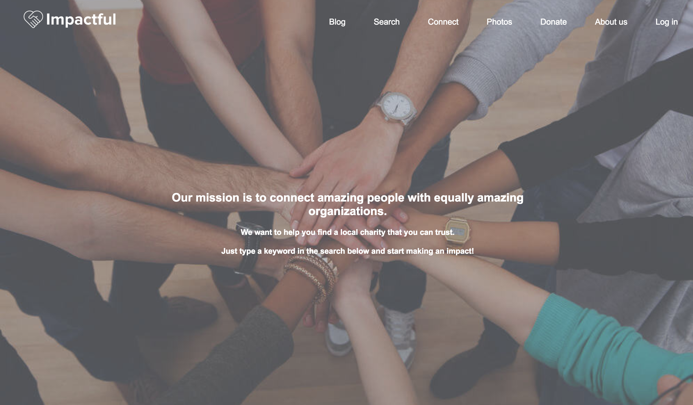
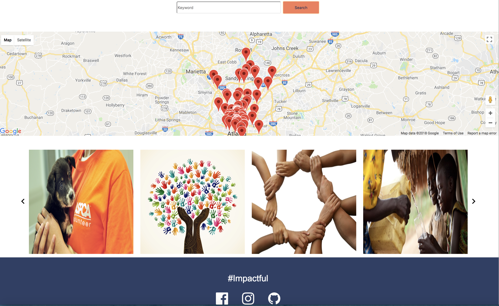
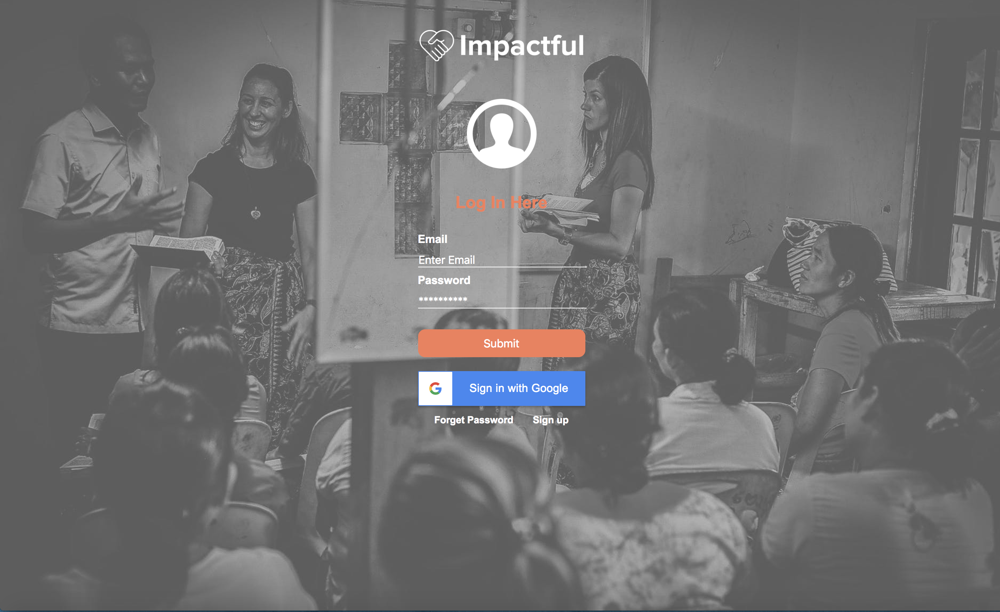
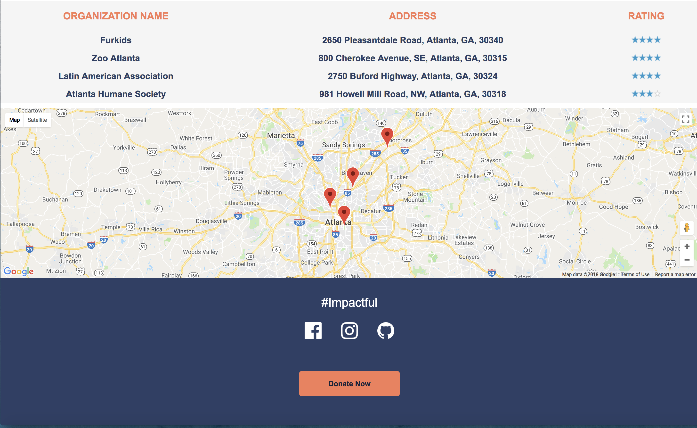
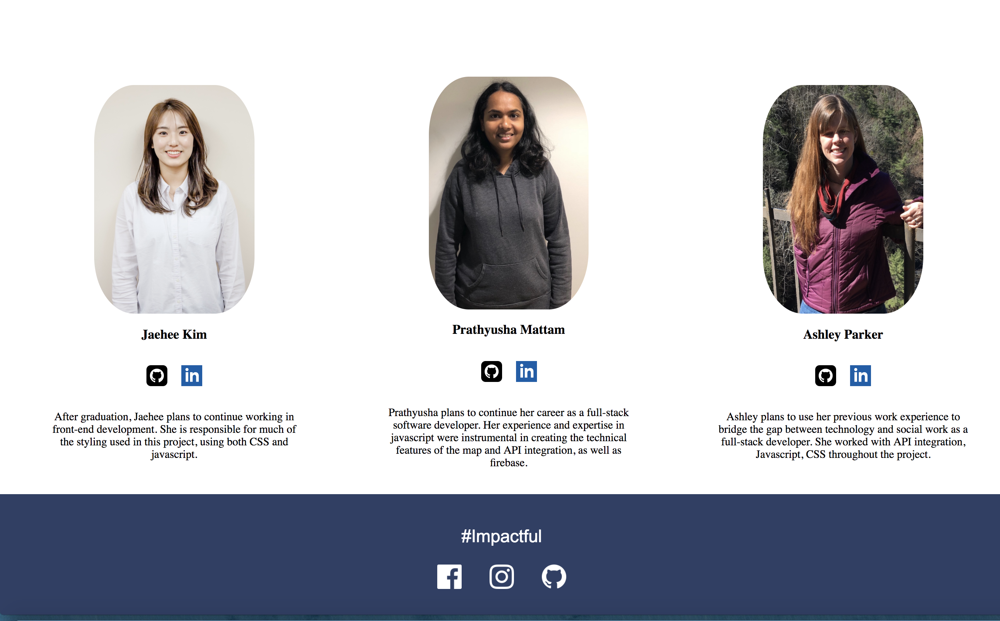

## Impactful:

Impactful is a website used by socially generous volunteers looking to donate time or money
in Metro area. Potential volunteers in the metro area will be able to search for local charities, view
ratings, and make informed decisions on how best to use their time or money to
maximize impact.

## GitHub Link:

https://pmattam.github.io/Impactful/

## Team members 

* [Jaehee Kim](https://github.com/jaeheekim051510)	

* [Prathyusha Mattam](https://github.com/pmattam)		

* [Ashley Parker](https://github.com/aparker22)

## Technologies used:
**Languages:**
* JavaScript
* HTML5
* CSS

## Screenshots:

## Project History:
07/03/2018 - Project Start
